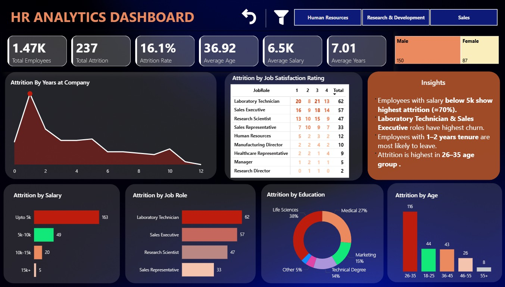

# HR Analytics - Employee Attrition Analysis.

An interactive Power BI dashboard analyzing employee attrition 
patterns across departments, salary bands, age groups, and 
job satisfaction levels.

## Dashboard Preview

## Project Overview
Analyzed HR data of 1,470+ employees to identify key drivers 
of attrition, helping HR teams prioritize retention strategies 
across departments and job roles.

## Tech Stack
- **Power BI Desktop** — Dashboard & visualizations.
- **DAX** — Measures and calculated columns.
- **Excel** — Source data (HR_raw_data)

## Key Features
- Attrition Rate KPI with department-level drill-through.
- Attrition breakdown by Salary, Job Role, Age & Education
- Job Satisfaction Rating matrix by Job Role
- Attrition by Years at Company trend analysis
- Gender split and demographic KPI cards
- Dynamic department filter (HR / R&D / Sales)
- Built-in Insights panel with key findings

## Files
| File | Description |
|------|-------------|
| `HR_Analytics_Employee_Attrition_Analysis.pbix` | Main Power BI file |
| `HR_raw_data.xlsx` | In Data folder- Source Excel data |
| `dashboard-preview.jpg` | In Images folder -  Dashboard screenshot |

## DAX Measures Created
- `Attrition Rate` — Attrition Count / Total Employees
- `Total Attrition` — Count of Yes in Attrition column
- `Total Employees` — Count of all employees
- `Average Age` — Average of Age column
- `Average Salary` — Average of MonthlyIncome

## Key Insights
- Overall attrition rate is **16.1%** — above healthy 10-12% benchmark.
- Employees earning **below $5K** account for 163 of 237 attritions (~70%).
- **Laboratory Technician & Sales Executive** roles have highest churn at 62 and 57.
- **1-2 years tenure** employees are most at risk — classic early exit pattern.
- **26-35 age group** drives 116 attritions — highest of any age band.
- **Life Sciences (38%)** and **Medical (27%)** education fields show most attrition.
- Employees with **Job Satisfaction rating 1** show significantly higher exits.
- **R&D department** has most attrition volume due to largest headcount.

## Author
Shubham Kumar Bhakta
